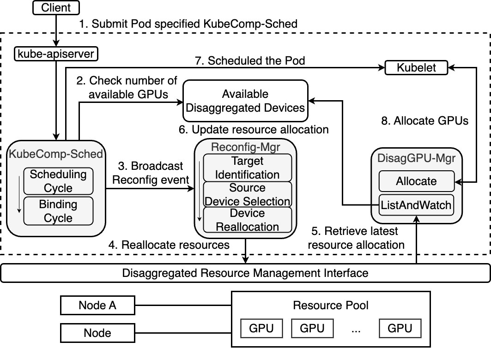

# KubeComp
_**"KubeComp: Resource-centric Composable Container Orchestrator for GPU Pooling" is  accepted by  UCC 2024!**_
## Introduction
KubeComp is the first solution for Kubernetes to support GPU pooling based on a composable infrastructure. KubeComp makes Kubernetes
aware of the underlying composable infrastructure and provides on-demand, optimized, and automated resource management for service deployment.



## Deployment
- [Cluster Setup](./01cluster-setup/README.md)
- [Resource Pool Simulator](./02resource-pool/README.md)
- [Disaggregate Device Plugin](./03disag-device-plugin/README.md)
- [KubeComp Scheduler](./04kubecomp-sched/README.md)
- [Reconfig Manager](./05reconfig-mgr/README.md)

## Demo
This is an example yaml file demonstrate how to specify the disaggregated resource and the KubeComp Scheduler.

```yaml
apiVersion: v1
kind: Pod
metadata:
  name: demo-pod
spec:
  schedulerName: kubecomp-scheduler
  containers:
  - name: demo-pod
    image: "alpine"
    command: ['sh', '-c', 'echo "start" && sleep 3000']
    resources:
      requests:
        memory: "128Mi"
        cpu: "500m"
        falcon.com/gpu: 5
      limits:
        memory: "128Mi"
        cpu: "500m"
        falcon.com/gpu: 5
  restartPolicy: Never
```

Since the cluster was originally set up with three worker nodes, each with 4 GPUs, the reallocation of 1 GPU will be observed.
